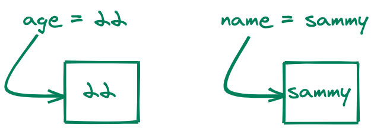
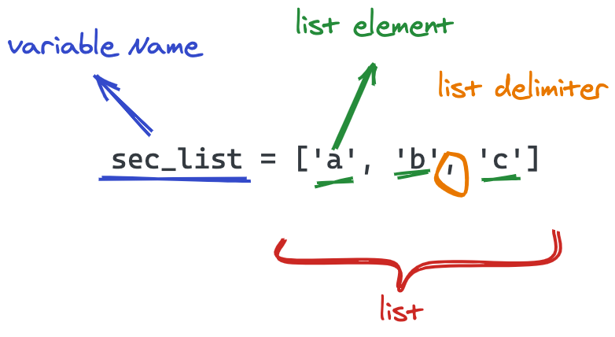
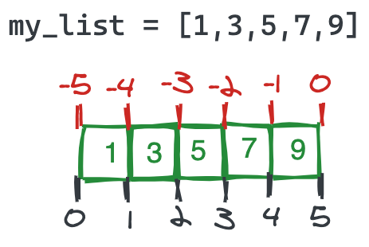

# Containers

Containers in this instance are used as an analogy for data structures in Python. They serve to hold values in different forms in a program and the form we choose could depend on the type of value or operations we would like to carry out on them.

## Variables

We have seen variables already but now let's look at variables as containers



So variables are like a box or container that hold just one thing, and when you call them (e.g `print(age)``) it returns the value stored in that box.

To store multiple things you need to create multiple variables which could be fine if you are writing a small program, but could quickly get out of hand for larger programs. That is where other forms of 'containers' come in.

## Lists

This is a compound data type that is used to group multiple values. It is written by 'listing' comma-separated items in a square bracket.

```python
# first List
my_list = [1,3,5,7,9]
sec_list = ['a','b','c']

```



### Indexing

Items in a python list are accessed using their indexes which is zero-based, i.e. the first element has an index of 0, the second 1 and so on...



Hence to access a particular value, you can use its position in the list. e.g. `print(my_list[2])` would yield `5`

### Slicing

This returns a sublist of a range of equally spaced elements from an original list.

This is the syntax: `my_list[start:stop:step]` and all slicing parameters are optional

### Mutation

Lists are mutable, that is you can change the values of the elements they contain.

```python
my_list = ['ada', 'queen','john']
my_list[2] = 'cynthia'
print(my_list)

```

### Adding and Removing Elements

To extend the list by one item, you can use the `append` method.

```python
my_list.append("stephanie")
```

To remove an element from a list, you can use the `pop` method.

```python
my_list.pop()
```

To see other features of lists check the [link](https://docs.python.org/3/tutorial/datastructures.html#more-on-lists)

## Dictionaries

These are 'containers' with unordered key-value pairs of elements. An analogy is that they are like a table:

| key  | value  |
| ---- | ------ |
| name | "John" |
| age  | 23     |
